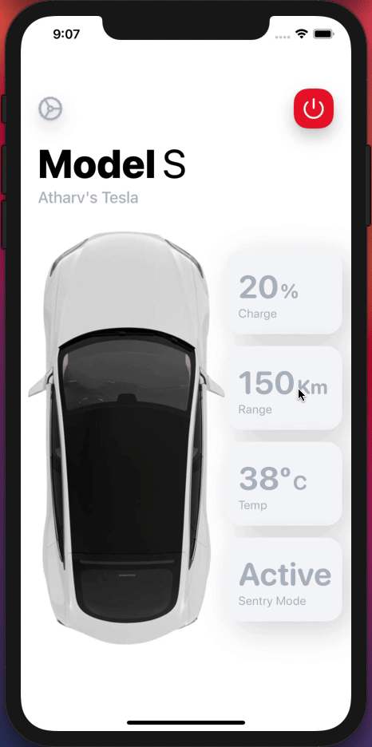
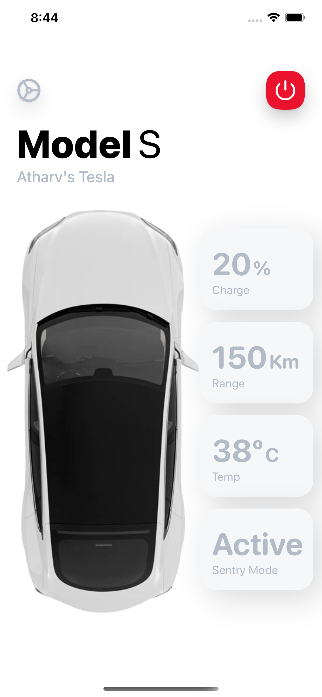
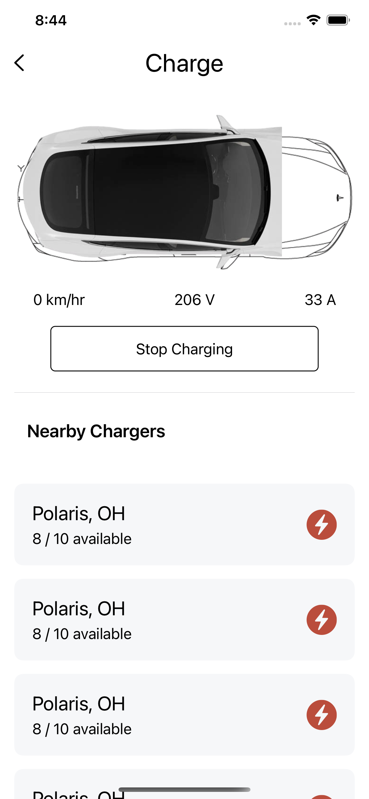

# TeslaApp
This is a concept for tesla ios app. It is made by using SwiftUI.

# Video TeslaApp

# ScreenShots TeslaApp

# Features To Be Added
1) Add a slider to set the maximum charge limit.
2) Add side panel slider for more options.
3) Add advanced control panel.
4) Add a Tabbar for various pages.

